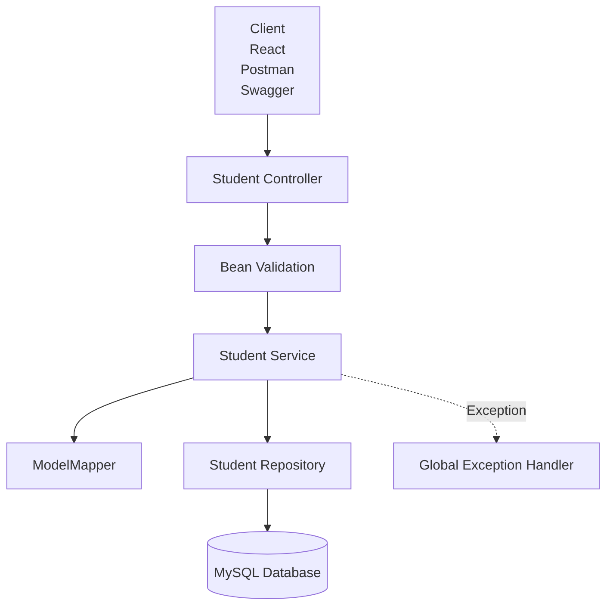

<div align="center">

# 🎓 Imperion Student Management


### A Production-Ready Student Management REST API built with Spring Boot

<p>


</p>

<p>


</p>

A production-style **Student Management REST API** built using **Spring Boot**, following industry-standard backend architecture with DTOs, Bean Validation, Global Exception Handling, ModelMapper, Swagger/OpenAPI, Soft Delete, Restore APIs, Search APIs, Count APIs, Course Management, and Multiple Subjects support.

⭐ Built to demonstrate clean backend architecture and real-world Spring Boot development practices.

</div>

---

# 📑 Table of Contents

- About the Project
- Features
- Tech Stack
- Architecture
- Project Structure
- Database Design
- Getting Started
- Configuration
- REST API Endpoints
- Request & Response Examples
- Validation
- Exception Handling
- Swagger Documentation
- Testing
- Future Roadmap
- Deployment
- License
- Author

---

# 📖 About the Project

**Imperion Student Management** is a production-style backend application developed using **Spring Boot**.

The goal of this project is not just performing CRUD operations, but demonstrating how modern backend applications are structured in the industry.

The project follows a **layered architecture**, where each layer has a single responsibility.

Instead of exposing database entities directly, all communication happens through **DTOs**, making the API secure and maintainable.

The application also includes validation, centralized exception handling, automatic object mapping, interactive API documentation, soft deletion, restore functionality, duplicate email validation, searching, and analytics endpoints.

This project is designed as a backend portfolio project suitable for internships, placements, and backend developer interviews.

---

# ✨ Features

| Status | Feature | Description |
|---------|----------|-------------|
| ✅ | Create Student | Register a new student |
| ✅ | Get Student | Fetch student by ID |
| ✅ | Get All Students | Retrieve all active students |
| ✅ | Update Student | Update existing student details |
| ✅ | Hard Delete | Permanently remove student |
| ✅ | Soft Delete | Archive student without deleting |
| ✅ | Restore Student | Restore archived students |
| ✅ | DTO Pattern | Entity never exposed directly |
| ✅ | Bean Validation | Request validation using Jakarta Validation |
| ✅ | Global Exception Handling | Consistent API error responses |
| ✅ | ModelMapper | Automatic DTO ↔ Entity mapping |
| ✅ | Swagger/OpenAPI | Interactive API Documentation |
| ✅ | Duplicate Email Validation | Prevent duplicate student registration |
| ✅ | Course Management | Store course information |
| ✅ | Multiple Subjects | Supports multiple enrolled subjects |
| ✅ | Search by Name | Search active students |
| ✅ | Search by Email | Search active students |
| ✅ | Search by Course | Search students course-wise |
| ✅ | Count Students | Count all active students |
| ✅ | Count by Course | Analytics endpoint |
| ✅ | Count by Age | Analytics endpoint |

---

# 🛠 Tech Stack

| Category | Technology |
|------------|---------------------------|
| Language | Java 21 |
| Framework | Spring Boot 4 |
| ORM | Hibernate |
| Persistence | Spring Data JPA |
| Database | MySQL |
| Validation | Jakarta Bean Validation |
| Object Mapping | ModelMapper |
| Documentation | Swagger / OpenAPI 3 |
| Build Tool | Maven |
| API Style | REST |
| Version Control | Git & GitHub |
| IDE | IntelliJ IDEA |

---
# 🏗 Architecture

The project follows a **Layered Architecture**, where each layer has a single responsibility.


### Request Flow

```
Client

↓

Controller

↓

Bean Validation

↓

Service Layer

↓

ModelMapper

↓

Repository

↓

Database
```

The application follows separation of concerns where each layer is responsible for only one task, making the project scalable, maintainable, and production-ready.

---

# 📂 Project Structure

```
imperion-student-management
│
├── backend
│   │
│   ├── src
│   │   ├── main
│   │   │   ├── java
│   │   │   │
│   │   │   └── com.maxx.imperion
│   │   │       │
│   │   │       ├── config
│   │   │       ├── controller
│   │   │       ├── dto
│   │   │       ├── entity
│   │   │       ├── exception
│   │   │       ├── repository
│   │   │       ├── response
│   │   │       ├── service
│   │   │       └── ImperionStudentManagementApplication.java
│   │   │
│   │   └── resources
│   │       ├── application.properties
│   │       └── static
│   │
│   ├── pom.xml
│   └── README.md
│
└── frontend
    └── (Coming Soon)
```

---

# 🗄 Database Design

## Table : student

| Column | Type |
|----------|-----------|
| id | BIGINT |
| name | VARCHAR |
| age | INT |
| email | VARCHAR |
| rollno | INT |
| course | VARCHAR |
| deleted | BOOLEAN |
| created_at | DATETIME |
| updated_at | DATETIME |

---

## Table : student_subjects

| Column | Type |
|-----------|------------|
| student_id | BIGINT |
| subject_name | VARCHAR |

A student can enroll in multiple subjects.

Spring JPA automatically manages this table using:

```java
 @ElementCollection
```

without creating a separate Subject entity.

---

# ⚙ Getting Started

## Prerequisites

- Java 21
- Maven
- MySQL 8+
- IntelliJ IDEA

---

## Clone Repository

```bash
git clone https://github.com/madebymaxx/imperion-student-management.git
```

---

## Move into Project

```bash
cd imperion-student-management/backend
```

---

## Configure Database

Open

```
src/main/resources/application.properties
```

Update

```properties
spring.datasource.username=root
spring.datasource.password=your_password
```

Database will automatically be created.

---

## Run Application

```bash
./mvnw spring-boot:run
```

or simply run

```
ImperionStudentManagementApplication.java
```

from IntelliJ IDEA.

---

## Server

```
http://localhost:8080
```

Application is now ready.
# 🌐 REST API Endpoints

## Student APIs

| Method | Endpoint | Description |
|----------|--------------------------|------------------------------------|
| POST | `/api/students` | Create a new student |
| GET | `/api/students` | Get all active students |
| GET | `/api/students/{id}` | Get student by ID |
| PUT | `/api/students/{id}` | Update student details |
| DELETE | `/api/students/{id}` | Permanently delete student |
| PATCH | `/api/students/soft-delete/{id}` | Archive student |
| PATCH | `/api/students/restore/{id}` | Restore archived student |

---

## Search APIs

| Method | Endpoint |
|----------|--------------------------------|
| GET | `/api/students/search/name?name=Maxx` |
| GET | `/api/students/search/email?email=maxx@gmail.com` |
| GET | `/api/students/search/course?course=B.Tech` |

---

## Count APIs

| Method | Endpoint |
|----------|--------------------------------|
| GET | `/api/students/count` |
| GET | `/api/students/count/course?course=B.Tech` |
| GET | `/api/students/count/age?age=20` |

---

# 📥 Sample Request

## Create Student

```http
POST /api/students
```

```json
{
  "name": "Maxx",
  "age": 20,
  "email": "maxx@gmail.com",
  "rollno": 101,
  "course": "B.Tech",
  "subjects": [
    "Java",
    "DBMS",
    "Operating System"
  ]
}
```

---

# 📤 Sample Response

```json
{
  "id": 1,
  "name": "Maxx",
  "age": 20,
  "email": "maxx@gmail.com",
  "rollno": 101,
  "course": "B.Tech",
  "subjects": [
    "Java",
    "DBMS",
    "Operating System"
  ],
  "message": "Student created successfully",
  "createdAt": "2026-07-16T18:40:12",
  "updatedAt": "2026-07-16T18:40:12"
}
```

---

# ✅ Validation Rules

The project uses **Jakarta Bean Validation** to validate incoming requests.

### Student Name

- Cannot be blank
- Minimum 2 characters
- Maximum 50 characters

---

### Age

- Required
- Minimum 18
- Maximum 100

---

### Email

- Required
- Must be valid
- Duplicate emails are not allowed

---

### Roll Number

- Required
- Must be positive

---

### Course

- Required
- Minimum 2 characters
- Maximum 50 characters

---

### Subjects

- At least one subject required
- Subject name cannot be blank
- Subject name length must be between 2 and 50 characters

---

# ⚠ Exception Handling

The project uses **Global Exception Handling** using `@RestControllerAdvice`.

Handled exceptions include:

- Validation Errors
- Resource Not Found
- Duplicate Email
- Invalid Request
- Internal Server Errors

Example Error Response

```json
{
  "timestamp": "2026-07-16T19:20:10",
  "status": 404,
  "error": "Not Found",
  "message": "Student with id 10 not found"
}
```

---

# 📖 API Documentation

Swagger UI is integrated for interactive API testing.

### Swagger UI

```
http://localhost:8080/swagger-ui.html
```

or

```
http://localhost:8080/swagger-ui/index.html
```

### OpenAPI Docs

```
http://localhost:8080/api-docs
```

Swagger allows developers to:

- Test APIs
- View request & response models
- Explore endpoints
- Read API documentation

without using Postman.

---

# 🧪 API Testing

The application has been manually tested using:

- Swagger UI
- Postman

The following workflows were verified:

- Create Student
- Update Student
- Get Student
- Get All Students
- Soft Delete
- Restore
- Hard Delete
- Search APIs
- Count APIs
- Duplicate Email Validation
- Validation Errors
- Exception Responses
# 🚀 Future Roadmap

The current version focuses on building a production-style backend using Spring Boot.

Future improvements planned for this project include:

- JWT Authentication & Authorization
- Spring Security
- Role-Based Access Control (Admin / Student)
- Pagination
- Sorting
- Filtering
- Docker Support
- CI/CD Pipeline
- AWS Deployment
- Unit & Integration Testing
- Redis Caching
- Email Notifications
- File Upload Support
- React Frontend
- Microservices Architecture

---

# 📷 Screenshots

## Swagger UI

> Add a screenshot of Swagger UI here.

Example:

```
docs/
└── swagger-home.png
```

---

# 📈 Learning Outcomes

This project helped in understanding:

- Layered Architecture
- REST API Design
- DTO Pattern
- Bean Validation
- Spring Data JPA
- Hibernate
- MySQL Integration
- ModelMapper
- Global Exception Handling
- Swagger/OpenAPI
- Soft Delete Implementation
- Search APIs
- Count APIs
- Git & GitHub Workflow

---

# 🤝 Contributing

Contributions are welcome.

If you'd like to improve this project:

1. Fork the repository
2. Create your feature branch

```bash
git checkout -b feature/new-feature
```

3. Commit your changes

```bash
git commit -m "Add new feature"
```

4. Push to your branch

```bash
git push origin feature/new-feature
```

5. Open a Pull Request

---

# 📄 License

This project is licensed under the MIT License.

See the LICENSE file for more information.

---

# 👨‍💻 Author

## Nikhil Singh

Backend Developer | Java | Spring Boot | REST APIs

GitHub

https://github.com/madebymaxx

---

# ⭐ If you found this project useful...

Give this repository a ⭐ on GitHub.

It motivates me to build more production-ready projects.

---

<div align="center">

## Thank You ❤️

Made with ☕ using Spring Boot

</div>
